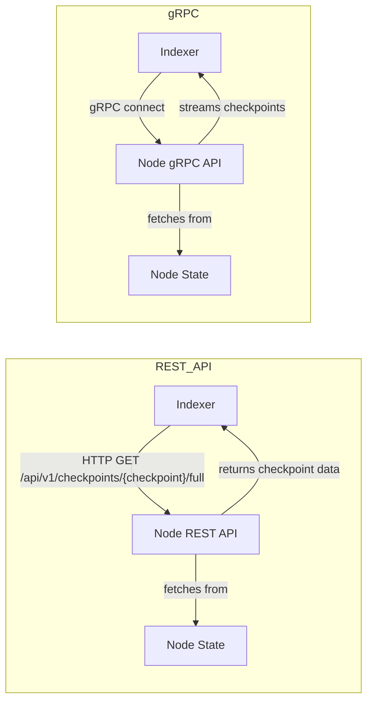

# IOTA Checkpoint gRPC API (Proof of Concept)

This crate introduces a proof-of-concept (PoC) gRPC API for streaming IOTA checkpoints. The primary goal of this API is to provide a more efficient and lower-latency method for fetching checkpoints, specifically intended to replace the existing REST-API polling or filesystem-based synchronization used by the indexer and data ingestion services. This reduces the delay between checkpoint creation and their subsequent indexing or processing.

The gRPC API supports subscriptions, similar to the `INX` (IOTA Node Extension) component in Hornet, allowing clients to receive new checkpoints as they are confirmed ([reference](https://github.com/iotaledger/hornet/blob/3ab964191f30ec70f4d54dc121ea01bc48497bc1/components/inx/server_milestones.go#L169)).

## Features

The `CheckpointService` provides the following RPC endpoints:

- `StreamCheckpoints`: Stream checkpoint data based on a flexible range.
- `GetEpochFirstCheckpointSequenceNumber`: Query the first checkpoint sequence number for a given epoch (useful for robust reset and epoch boundary handling).

### Proto

```protobuf
service CheckpointService {
  rpc StreamCheckpoints (StreamRequest) returns (stream Checkpoint);
  rpc GetEpochFirstCheckpointSequenceNumber (EpochRequest) returns (CheckpointSequenceNumberResponse);
}

message StreamRequest {
  optional uint64 start_index = 1;
  optional uint64 end_index = 2;
}

message EpochRequest {
  uint64 epoch = 1;
}

message CheckpointSequenceNumberResponse {
  uint64 sequence_number = 1;
}

message Checkpoint {
  uint64 index = 1;
  bytes data = 2;
}
```

### Streaming Range Logic

- **Both `start_index` and `end_index` omitted:**
  - Streams from 0 to the maximum possible checkpoint index (streams all available).
- **Only `start_index` provided:**
  - Streams from `start_index` to the maximum possible checkpoint index.
- **Only `end_index` provided:**
  - Streams from 0 to `end_index`.
- **Both `start_index` and `end_index` provided:**
  - Streams from `start_index` to `end_index` (inclusive).

The service does not attempt to compute a "latest" checkpoint index, making it robust to on-the-fly checkpoint generation.

## REST vs. gRPC Checkpoint Streaming: Comparison

| Aspect               | REST API Path                                    | gRPC API Path                                    | Alignment Status          |
| -------------------- | ------------------------------------------------ | ------------------------------------------------ | ------------------------- |
| **Purpose**          | Fetch full checkpoint data via HTTP              | Stream full checkpoint data via gRPC             | Aligned (for checkpoints) |
| **Data Model**       | `CheckpointData` (BCS-encoded)                   | `CheckpointData` (BCS-encoded in bytes field)    | Aligned                   |
| **Worker Interface** | Implements `Worker` trait (`process_checkpoint`) | Implements `Worker` trait (`process_checkpoint`) | Aligned                   |
| **Client Location**  | Inline HTTP client in worker                     | Shared gRPC client in `iota-grpc-api`            | Aligned (modular)         |
| **Test Coverage**    | Integration tests with REST node                 | Integration tests with gRPC node                 | Aligned                   |
| **Scope**            | Can fetch any checkpoint, full or summary        | **Only streams checkpoints**                     | Aligned (by requirement)  |
| **Extensibility**    | Can add more REST endpoints if needed            | Only checkpoint streaming is implemented         | Aligned (by requirement)  |

## Visual Comparison



## Key Differences

| Aspect               | REST API Flow                           | gRPC Flow                                           |
| -------------------- | --------------------------------------- | --------------------------------------------------- |
| **Server**           | Node REST API                           | Node gRPC API                                       |
| **Client**           | Indexer (HTTP client)                   | Indexer (gRPC client)                               |
| **Data Transfer**    | Polling (pull)                          | Streaming (push)                                    |
| **Protocol**         | HTTP/1.1 or HTTP/2, JSON/BCS            | HTTP/2, Protocol Buffers (protobuf)                 |
| **Efficiency**       | Higher latency (polling interval)       | Lower latency (real-time streaming)                 |
| **Setup**            | `enable_rest_api = true` in node config | `grpc_api_address` set in node config               |
| **Integration Test** | Yes (REST tests)                        | Yes (`grpc_ingestion.rs`, `grpc_blob_ingestion.rs`) |

## In summary

- **REST API:** Indexer pulls checkpoints from the node by polling HTTP endpoints.
- **gRPC API:** Indexer receives checkpoints as a real-time stream from the node.

> **Note:**
> The gRPC API now provides an endpoint for querying the first checkpoint of a given epoch (`GetEpochFirstCheckpointSequenceNumber`), making robust reset and epoch boundary handling possible for clients. Handling epoch boundaries or resets can be implemented by the client by inspecting the streamed checkpoint data or by using this endpoint.

## Usage

The `iota-grpc-api` crate defines the gRPC service and its messages. The `iota-node` crate integrates and starts this gRPC server if a `grpc_api_address` is configured.

A shared gRPC client (`GrpcNodeClient`) is provided by this crate and should be used by downstream consumers (e.g., `iota-indexer`, `iota-data-ingestion`) to connect and stream checkpoints. This ensures all consumers use the same, up-to-date protocol and data model.

**Example:**

```rust
use iota_grpc_api::client::GrpcNodeClient;

let mut client = GrpcNodeClient::connect("http://localhost:50051").await?;
let mut stream = client.stream_checkpoints(0, Some(10)).await?;
while let Some(Ok(checkpoint)) = stream.next().await {
    // Deserialize and process checkpoint.data (BCS-encoded CheckpointData)
}
```

## Testing

You can run the tests for the new gRPC API to see detailed results using the following command:

```bash
cargo test -p iota-grpc-api -- --nocapture --test-threads=1
```

This command specifically targets the `iota-grpc-api` crate (`-p iota-grpc-api`), ensures that all test output is captured and displayed (`--nocapture`), and runs the tests sequentially with a single thread (`--test-threads=1`) to avoid potential conflicts or interleaved output, making it easier to review the results.

## gRPC Checkpoint Streaming: Test Suite

The following tests have been added to ensure the correctness and robustness of the gRPC checkpoint streaming API:

### **Integration Tests**

Located in `crates/iota-grpc-api/tests/`:

- **`checkpoint_stream.rs`**
  - **`test_start_index_only`**: Verifies that when only `start_index` is provided, the stream begins from the specified starting point and retrieves all subsequent checkpoints up to the latest available.
  - **`test_start_and_end_index`**: Validates that when both `start_index` and `end_index` are provided, the streamed checkpoints are precisely within the inclusive range defined by both bounds.
  - **`test_end_index_only`**: Focuses on the scenario where only `end_index` is specified, confirming that only the checkpoint at the specified `end_index` is streamed.

- **`checkpoint_e2e.rs`**
  - **`e2e_stream_checkpoints`**: End-to-end test that streams all available checkpoints from genesis when neither `start_index` nor `end_index` is provided.
  - **`test_get_epoch_first_checkpoint_sequence_number`**: Tests the gRPC endpoint for querying the first checkpoint of a given epoch.

### **How to Run the Tests**

- **Run all tests for the crate:**
  ```bash
  cargo test -p iota-grpc-api -- --nocapture --test-threads=1
  ```

These tests ensure that the gRPC streaming API behaves as expected for all supported request patterns and edge cases, including epoch boundary and reset handling. All downstream consumers are encouraged to run these tests when upgrading or integrating the gRPC API.

## Downstream Integration Tests: gRPC Checkpoint Streaming

The following integration tests have been added in downstream crates to ensure that the gRPC checkpoint streaming API works as expected for real consumers:

### **iota-data-ingestion**

- **`tests/grpc_blob_ingestion.rs`**
  - **`test_grpc_blob_worker_reset_logic`**: Comprehensive test that covers streaming checkpoints, simulating a stale local watermark, verifying ingestion, simulating missing blobs, and testing worker reset and recovery logic. This test ensures robust recovery from stale state and correct handling of checkpoint ingestion and reset.

  **How to run:**
  ```bash
  cargo test -p iota-data-ingestion --test grpc_blob_ingestion -- --nocapture
  ```

### **iota-indexer**

- **`tests/grpc_ingestion.rs`**
  - **No active tests implemented.** (The file contains a placeholder for `test_grpc_checkpoint_stream`, but it is not implemented.)

  **How to run:**
  ```bash
  cargo test -p iota-indexer --test grpc_ingestion -- --nocapture
  ```

These tests are recommended for all downstream consumers and contributors to verify that gRPC checkpoint streaming works as expected in real-world integration scenarios.
