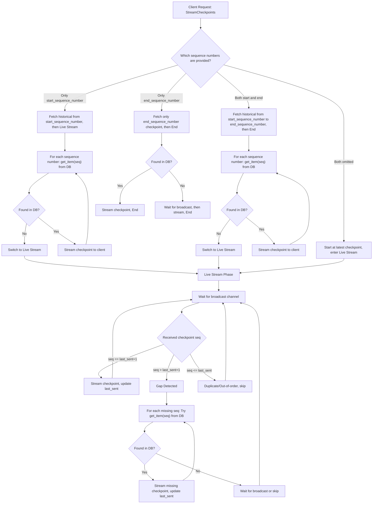
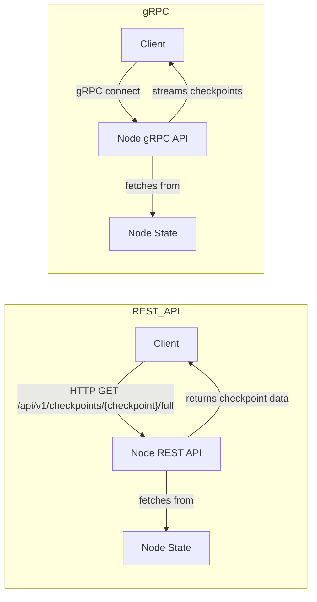

# IOTA Checkpoint gRPC API (Proof of Concept)

This crate introduces a proof-of-concept (PoC) gRPC API for streaming IOTA checkpoints. The primary goal of this API is to provide a more efficient and lower-latency method for fetching checkpoints, specifically intended to replace the existing REST-API polling or filesystem-based synchronization. This reduces the delay between checkpoint creation and their subsequent processing by external services.

The gRPC API supports subscriptions, similar to the `INX` (IOTA Node Extension) component in Hornet, allowing clients to receive new checkpoints as they are confirmed ([reference](https://github.com/iotaledger/hornet/blob/3ab964191f30ec70f4d54dc121ea01bc48497bc1/components/inx/server_milestones.go#L169)).

## Features

The `CheckpointService` provides the following RPC endpoints:

- `StreamCheckpoints`: Stream checkpoint data based on a flexible range.
- `GetEpochFirstCheckpointSequenceNumber`: Query the first checkpoint sequence number for a given epoch (useful for robust reset and epoch boundary handling).

### Proto

See the full protobuf schema in [`checkpoint.proto`](proto/checkpoint.proto).

### Streaming Range Logic

For all cases, the `full` flag determines the data type:

- If `full=false` (default): streams `CertifiedCheckpointSummary` (BCS-encoded in bytes field)
- If `full=true`: streams `CheckpointData` (BCS-encoded in bytes field)

The four supported range patterns:

- **Both `start_sequence_number` and `end_sequence_number` omitted:**
  - Streams the latest checkpoint and keeps streaming new ones as they arrive.
- **Only `start_sequence_number` provided:**
  - Streams from `start_sequence_number` and keeps streaming new ones as they arrive.
- **Only `end_sequence_number` provided:**
  - Streams only the checkpoint at `end_sequence_number`. Note that the end_sequence_number can be a future checkpoint, which is not streamed yet.
- **Both `start_sequence_number` and `end_sequence_number` provided:**
  - Streams from `start_sequence_number` to `end_sequence_number` (inclusive). Note that the end_sequence_number can be a future checkpoint, which is not streamed yet.

The service does not attempt to compute a "latest" checkpoint sequence number, making it robust to on-the-fly checkpoint generation.

#### Streaming Flow and Gap Handling

The following flowchart illustrates how the `CheckpointGrpcService` handles historical data, live streaming, gap detection, and gap-filling (resend) for all supported streaming patterns:



**Explanation:**

- **Historical fetch**: Always tries to get each requested checkpoint from the DB first.
- **Live stream**: Waits for new checkpoints on the broadcast channel. If a gap is detected (missed checkpoints), the service tries to fill the gap from the DB before resuming live streaming.
- **End sequence number only**: Only streams the requested checkpoint, from DB if possible, otherwise waits for it to appear on the broadcast channel.

This logic ensures robust, real-time, and gap-free checkpoint streaming for all client request patterns.

## REST vs. gRPC Checkpoint Streaming: Comparison

| Aspect               | REST API Path                                    | gRPC API Path                                    | Alignment Status          |
| -------------------- | ------------------------------------------------ | ------------------------------------------------ | ------------------------- |
| **Purpose**          | Fetch full checkpoint data via HTTP              | Stream full checkpoint data via gRPC             | Aligned (for checkpoints) |
| **Data Model**       | `CheckpointData` (BCS-encoded)                   | `CheckpointData` (BCS-encoded in bytes field)    | Aligned                   |
| **Client Location**  | Inline HTTP client in consumer                   | Shared gRPC client in `iota-grpc-api`            | Aligned (modular)         |
| **Test Coverage**    | Integration tests with REST node                 | Integration tests with gRPC node                 | Aligned                   |
| **Scope**            | Can fetch any checkpoint, full or summary        | **Only streams checkpoints**                     | Aligned (by requirement)  |
| **Extensibility**    | Can add more REST endpoints if needed            | Only checkpoint streaming is implemented         | Aligned (by requirement)  |

## Visual Comparison



## Key Differences

| Aspect               | REST API Flow                           | gRPC Flow                                                         |
| -------------------- | --------------------------------------- | ----------------------------------------------------------------- |
| **Server**           | Node REST API                           | Node gRPC API                                                     |
| **Client**           | External client (HTTP client)          | External client (gRPC client)                                    |
| **Data Transfer**    | Polling (pull)                          | Streaming (push)                                                  |
| **Protocol**         | HTTP/1.1 or HTTP/2, JSON/BCS            | HTTP/2, Protocol Buffers (protobuf)                               |
| **Efficiency**       | Higher latency (polling interval)       | Lower latency (real-time streaming)                               |
| **Setup**            | `enable_rest_api = true` in node config | `enable_grpc_api = true` and `grpc_api_config` set in node config |
| **Integration Test** | Yes (REST tests)                        | Yes (checkpoint streaming tests)                                   |

## In summary

- **REST API:** External clients pull checkpoints from the node by polling HTTP endpoints.
- **gRPC API:** External clients receive checkpoints as a real-time stream from the node.

> **Note:**
> The gRPC API now provides an endpoint for querying the first checkpoint of a given epoch (`GetEpochFirstCheckpointSequenceNumber`), making robust reset and epoch boundary handling possible for clients. Handling epoch boundaries or resets can be implemented by the client by inspecting the streamed checkpoint data or by using this endpoint.

## Usage

The `iota-grpc-api` crate defines the gRPC service and its messages. The `iota-node` crate integrates and starts this gRPC server if `enable_grpc_api` is set to `true` and `grpc_api_config` is configured.

A shared gRPC client (`GrpcNodeClient`) is provided by this crate and should be used by downstream consumers to connect and stream checkpoints. This ensures all consumers use the same, up-to-date protocol and data model.

**Configuration Example:**

```toml
# In your node config file (e.g., fullnode.yaml)
enable_grpc_api: true
grpc_api_config:
  address: "0.0.0.0:50051"
  checkpoint_broadcast_buffer_size: 100
```

**Client Example:**

```rust
use iota_grpc_api::client::GrpcNodeClient;

let mut client = GrpcNodeClient::connect("http://localhost:50051").await?;
let mut stream = client.stream_checkpoints(0, Some(10), Some(false)).await?;
while let Some(Ok(checkpoint)) = stream.next().await {
    // Deserialize and process checkpoint.data (BCS-encoded CertifiedCheckpointSummary)
}
let mut stream = client.stream_checkpoints(None, Some(4), Some(true)).await?;
if let Some(Ok(checkpoint)) = stream.next().await {
    // Deserialize as CheckpointData
}
let mut stream = client.stream_checkpoints(Some(5), None, Some(true)).await?;
while let Some(Ok(checkpoint)) = stream.next().await {
    // checkpoint.data is BCS-encoded CheckpointData
}
```

## Testing

You can run the tests for the new gRPC API to see detailed results using the following command:

```bash
cargo test -p iota-grpc-api -- --nocapture --test-threads=1
```

This command specifically targets the `iota-grpc-api` crate (`-p iota-grpc-api`), ensures that all test output is captured and displayed (`--nocapture`), and runs the tests sequentially with a single thread (`--test-threads=1`) to avoid potential conflicts or interleaved output, making it easier to review the results.

## gRPC Checkpoint Streaming: Test Suite

The following tests have been added to ensure the correctness and robustness of the gRPC checkpoint streaming API:

### **Integration Tests**

Located in `crates/iota-grpc-api/tests/`:

- **`checkpoint_stream.rs`**
  - **`test_start_sequence_number_only`**: Streams all available checkpoints starting from the specified `start_sequence_number` (5). The test collects checkpoints from 5 up to 30, covering both buffered and live-streamed checkpoints, and then ends.
  - **`test_start_and_end_sequence_number`**: Streams checkpoints within the inclusive range defined by `start_sequence_number` (3) and `end_sequence_number` (7). The test collects checkpoints `[3, 4, 5, 6, 7]` and then ends, ensuring no live checkpoints are collected beyond the end sequence number.
  - **`test_end_sequence_number_only`**: Streams only the checkpoint at the specified `end_sequence_number` (4). The test collects `[4]` and then ends, verifying that only the requested checkpoint is streamed and the stream terminates immediately after.
  - **`test_future_end_sequence_number_only_full`**: Streams only the checkpoint at a future `end_sequence_number` (e.g., 100). The test waits for the checkpoint to become available, collects it, and then ends.
  - **`test_both_indices_omitted`**: Streams all available buffered checkpoints (0..=10) and then continues to collect live checkpoints as they are produced, up to sequence number 24. The test collects checkpoints `[10, 11, 12, ..., 24]` to verify both buffered and live streaming.
  - **`test_historical_to_live_gap_fill`**: Verifies that the client can stream a continuous range of checkpoints from historical storage and seamlessly transition to live streaming, filling any gaps from the DB if the client is slow or the broadcast buffer overflows.
  - **`test_gap_fill_with_slow_client`**: Simulates a slow client and verifies that all checkpoints from 0 to 20 are received in order, even if the client falls behind and the server must fill gaps from the DB.

- **`checkpoint_e2e.rs`**
  - **`e2e_stream_checkpoints`**: End-to-end test that connects to a real node and streams checkpoints from the gRPC API with both sequence numbers omitted. The test collects the first two checkpoints (e.g., genesis and the next one) to verify that streaming works and new checkpoints are delivered in real time.
  - **`test_get_epoch_first_checkpoint_sequence_number`**: End-to-end test that streams all checkpoints from the node and verifies the epoch for each. It also tests the gRPC endpoint for querying the first checkpoint of a given epoch, ensuring that the correct sequence number is returned for both epoch 0 and epoch 1.
  - **`test_stream_full_checkpoint_data`**: Streams the full checkpoint data for a specific checkpoint (using `full=true` and `end_sequence_number=Some(seq)`), decodes it, and verifies the sequence number matches the requested checkpoint.

### **How to Run the Tests**

- **Run all tests for the crate:**
  ```bash
  cargo test -p iota-grpc-api -- --nocapture --test-threads=1
  ```

These tests ensure that the gRPC streaming API behaves as expected for all supported request patterns and edge cases, including gap-filling, end_sequence_number-only streaming, epoch boundary, and reset handling. All downstream consumers are encouraged to run these tests when upgrading or integrating the gRPC API.
