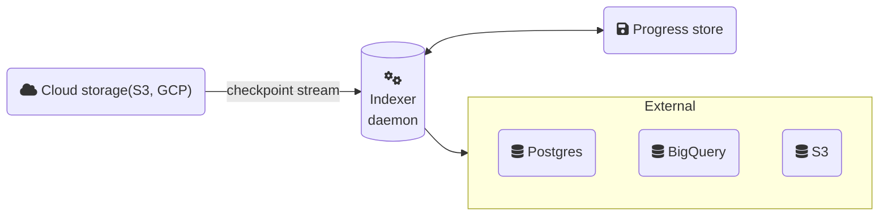
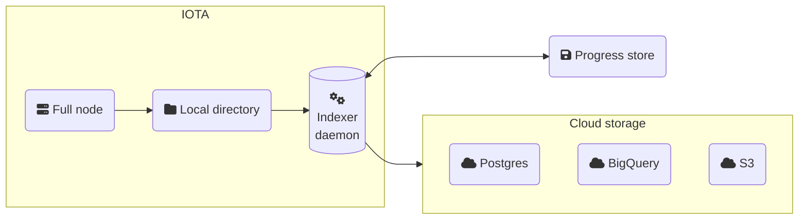

import Quiz from '@site/src/components/Quiz';
import questions from '/json/developer/advanced-topics/custom-indexer.json';
import CodeBlock from '@theme/CodeBlock';

You can build custom indexers using the IOTA data ingestion framework, which is maintained through the [iota-data-ingestion-core][iota-data-ingestion-core] library. To create an indexer, you subscribe to a checkpoint stream with full checkpoint content. This stream can be one of the publicly available streams from IOTA, one that you set up in your local environment, or a combination of the two.

Establishing a custom indexer helps improve latency, allows pruning the data of your IOTA full node, and provides efficient assemblage of checkpoint data.

## Setup

To start, you need to specify the proper dependencies in your `Cargo.toml`. Here is what the minimal manifest would look like for a new indexer:

```toml
[package]
name = "custom-indexer"
version = "0.1.0"
edition = "2021"
license = "Apache-2.0"

[dependencies]
iota-data-ingestion-core = { git = "https://github.com/iotaledger/iota", package = "iota-data-ingestion-core" }
iota-types = { git = "https://github.com/iotaledger/iota", package = "iota-types" }
```

:::caution

When resolving `git` dependencies, Cargo records the latest commit hash at the time of the build on `Cargo.lock`. Updating to newer versions requires manually calling `cargo update iota-data-ingestion-core iota-types` and updating `Cargo.lock`.

Network upgrades that introduce new types included in the checkpoint data will thus require updating custom indexers accordingly.

:::

## Interface and Data Format

To use the framework, implement a basic interface:

```rust
#[async_trait]
trait Worker: Send + Sync {
    type Error: Debug + Display;
    type Message: Send + Sync;

    async fn process_checkpoint(&self, checkpoint: Arc<CheckpointData>) -> Result<Self::Message, Self::Error>;
}
```

In this example, the [`CheckpointData`](https://iotaledger.github.io/iota/iota_types/full_checkpoint_content/struct.CheckpointData.html) struct represents full checkpoint content. The struct contains checkpoint summary and contents, as well as detailed information about each individual transaction.

## Checkpoint Stream Sources

Data ingestion for your indexer supports several checkpoint stream sources. A source can be [remote](#remote-reader), [local](#local-reader), or a [combination of both](#hybrid-mode).

### Remote Reader

The most straightforward stream source is to subscribe to a remote store of checkpoint contents. A remote source can be either a historical checkpoint store or a direct gRPC stream to an IOTA full node.

#### Historical Checkpoint Store

An IOTA full node is not guaranteed to retain all historical data, depending on its configuration, older checkpoints may be pruned. To sync from genesis up to the tip of the network, the indexer must rely on a dedicated checkpoint store. The IOTA Foundation provides the following endpoints for downloading historical checkpoint data.

**Historical Checkpoint Data**

For syncing historical data up to the tip of the network:

- Devnet: `https://checkpoints.devnet.iota.cafe/ingestion/historical`
- Testnet: `https://checkpoints.testnet.iota.cafe/ingestion/historical`
- Mainnet: `https://checkpoints.mainnet.iota.cafe/ingestion/historical`

**Live Checkpoint Streaming (Optional)**

For real-time streaming of current epoch checkpoints only:

- Devnet: `https://checkpoints.devnet.iota.cafe/ingestion/live`
- Testnet: `https://checkpoints.testnet.iota.cafe/ingestion/live`
- Mainnet: `https://checkpoints.mainnet.iota.cafe/ingestion/live`

:::info Historical vs Live Endpoints

| Feature              | Historical Endpoint                                                                                                                                                                                | Live Endpoint                                               |
| -------------------- | -------------------------------------------------------------------------------------------------------------------------------------------------------------------------------------------------- | ----------------------------------------------------------- |
| **Format**           | Batches multiple checkpoints into single files                                                                                                                                                     | Individual checkpoint files                                 |
| **Best for**         | Initial sync from genesis to near network tip                                                                                                                                                      | Real-time ingestion at network tip                          |
| **Latency behavior** | • Near zero latency during historical sync (processes batches as fast as possible)<br/>• Variable latency at network tip (waits for batch completion, typically ~1000 checkpoints or epoch change) | Minimal latency (published immediately)                     |
| **Data coverage**    | Complete data coverage from genesis                                                                                                                                                                | Current epoch only (older checkpoints automatically purged) |
| **Optimization**     | Throughput-focused for bulk ingestion                                                                                                                                                              | Low-latency processing                                      |

1. **Historical endpoint** should always be used as the primary source to guarantee complete data coverage from genesis
2. **Live endpoint** is optional for applications needing real-time access to the very latest checkpoints

:::



In this example, we'll explore a simple custom indexer that can ingest data from multiple sources: the `historical` and `live` endpoints, or directly from a local fullnode gRPC API. The [`RemoteUrl`](https://iotaledger.github.io/iota/iota_data_ingestion_core/reader/v2/enum.RemoteUrl.html) enum provides flexible configuration options for these different data sources, including hybrid configurations that combine multiple sources.

```rust file=<rootDir>/examples/custom-indexer/rust/remote_reader.rs
```

#### Fullnode gRPC Checkpoint Data Stream

For local development against a local network, or for public networks that expose a fullnode gRPC API, you can use the [`RemoteUrl::Fullnode`](https://iotaledger.github.io/iota/iota_data_ingestion_core/reader/v2/enum.RemoteUrl.html#variant.Fullnode) variant to connect directly to a fullnode. The gRPC stream delivers checkpoint data efficiently and with minimal latency. For more advanced use cases, it also exposes a filtering mechanism that lets you include only specific transactions in each checkpoint payload.

**Filtering Checkpoint Data**

When using the [`RemoteUrl::Fullnode`](https://iotaledger.github.io/iota/iota_data_ingestion_core/reader/v2/enum.RemoteUrl.html#variant.Fullnode) gRPC checkpoint stream API, you can register a filter that instructs the fullnode to include only specific transactions in each checkpoint payload.

Filtering occurs entirely server-side, so the ingestion framework performs no client-side filtering of its own. This is especially useful when a custom indexer targets specific data, since it avoids transferring irrelevant transactions over the network.

```rust file=<rootDir>/examples/custom-indexer/rust/remote_reader_with_filters.rs
```

In the example above, `CustomWorker::process_checkpoint` is only invoked for checkpoints that contain at least one matching transaction. Checkpoints with no matches are skipped.

A [`TransactionFilter`](https://iotaledger.github.io/iota/iota_data_ingestion_core/reader/filters/fullnode/struct.TransactionFilter.html) is built with a chained builder. Start from `TransactionFilter::new()` and add leaves with the named methods, such as `kinds()`, `sender()`, `receiver()`, and `execution_status()`. An empty `TransactionFilter::new()` is rejected by the fullnode, so always add at least one leaf before passing it to the reader.

:::info Composition semantics

- Each leaf you add **implicitly ANDs** with everything accumulated so far.
- Use `or()` to compose a logical **OR** with another `TransactionFilter`.
- Use `negate()` (or the `!` operator) for **NOT**. It wraps the entire filter accumulated so far, not just the most recent leaf ([see below](#negate-scoping)).

:::

A simple filter, showcasing implicit **AND** composition:

```rust
use iota_data_ingestion_core::filters::fullnode::{TransactionFilter, TransactionKind};

// Programmable AND success
let filter = TransactionFilter::new()
    .kinds([TransactionKind::Programmable])
    .execution_status(true);
```

Composition with **AND**, **OR**, and **NOT**:

```rust
// (Programmable AND success AND sender == Alice) OR NOT(receiver == Bob)
let filter = TransactionFilter::new()
    .kinds([TransactionKind::Programmable])
    .execution_status(true)
    .sender(alice)
    .or(!TransactionFilter::new().receiver(bob));
```

:::caution

#### `negate` scoping {#negate-scoping}

The `negate()` method (or the `!` operator) applies a logical **NOT** to the filter chain. Because the filter is built with a chained builder, `negate()` operates on everything accumulated up to that point, not just the most recent method call. The position of `negate()` determines its scope: calling it early negates only the criteria accumulated before it, which are then **AND**ed with whatever follows; calling it at the end negates the entire accumulated expression.

```rust
// (NOT Programmable) AND sender == Alice
TransactionFilter::new()
    .kinds([TransactionKind::Programmable])
    .negate()
    .sender(alice);

// NOT (Programmable AND sender == Alice)
TransactionFilter::new()
    .kinds([TransactionKind::Programmable])
    .sender(alice)
    .negate();
```

For complex expressions where the scoping is not visually obvious, build sub-filters as named bindings and combine them with `or()`.

:::

### Local Reader

Colocate the data ingestion daemon with a full node and enable checkpoint dumping on the latter to set up a local stream source. After enabling, the full node starts dumping executed checkpoints as files to a local directory, and the data ingestion daemon subscribes to changes in the directory through an inotify-like mechanism. This approach allows minimizing ingestion latency (checkpoint are processed immediately after a checkpoint executor on a full node) and getting rid of dependency on an externally managed bucket.

To enable, add the following to your [full node configuration](../../operator/full-node/overview.mdx) file:

```yaml
checkpoint-executor-config:
  checkpoint-execution-max-concurrency: 200
  local-execution-timeout-sec: 30
  data-ingestion-dir: <path to a local directory>
```



```rust file=<rootDir>/examples/custom-indexer/rust/local_reader.rs
```

Let's highlight a couple lines of code:

```rust
let worker_pool = WorkerPool::new(CustomWorker, "local_reader".to_string(), concurrency);
executor.register(worker_pool).await?;
```

The data ingestion executor can run multiple workflows simultaneously. For each workflow, you need to create a separate worker pool and register it in the executor. The `WorkerPool` requires an instance of the `Worker` trait, the name of the workflow (which is used for tracking the progress of the flow in the progress store and metrics), and concurrency.

The concurrency parameter specifies how many threads the workflow uses. Having a concurrency value greater than 1 is helpful when tasks are idempotent and can be processed in parallel and out of order. The executor only updates the progress/watermark to a certain checkpoint when all preceding checkpoints are processed.

### Hybrid Mode

Specify both a local and remote store as a fallback to ensure constant data flow. The framework always prioritizes locally available checkpoint data over remote data. It's useful when you want to start utilizing your own full node for data ingestion but need to partially backfill historical data or just have a failover.

```rust file=<rootDir>/examples/custom-indexer/rust/hybrid_reader.rs
```

### Manifest

Code for the `Cargo.toml` manifest file for the custom indexer.

```toml file=<rootDir>/examples/custom-indexer/rust/Cargo.toml
```

## Source Code

Find the following source code in the [IOTA repo](https://github.com/iotaledger/iota/tree/main/examples/custom-indexer/rust).

[iota-data-ingestion-core]: https://github.com/iotaledger/iota/tree/develop/crates/iota-data-ingestion-core

<Quiz questions={questions} />
